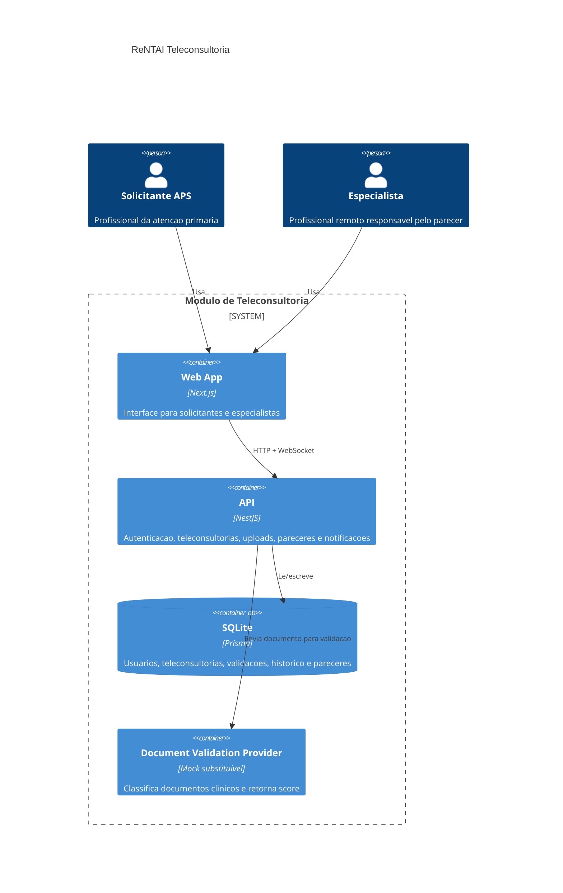

# Arquitetura - ReNTAI Teleconsultoria

## Contexto

O sistema atende dois atores principais:

- Solicitante APS: cria teleconsultorias e acompanha pareceres.
- Especialista: assume casos e registra parecer tecnico.

## Containers

## Decisoes principais

- Monorepo para manter backend, frontend e documentacao juntos.
- SQLite para reproducao local simples.
- Prisma para schema versionado e client tipado.
- Provider de IA mockado e substituivel por configuracao.
- WebSocket para notificar solicitante sem recarregar a pagina.
